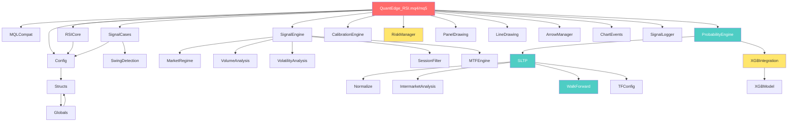

# QuantEdge — Kiến Trúc Platform Chi Tiết

## 1. Dependency Graph (Thứ Tự Include)



## 2. Module Inventory (31 files)

### Layer 1: Data / Infrastructure (7 files)

| File | Size | Chức năng |
|------|------|----------|
| `Config.mqh` | 16.9KB | Toàn bộ input parameters (279 dòng) |
| `Structs.mqh` | 10.5KB | 15 struct definitions (SignalData, ProbabilityData, EntryZone, etc.) |
| `Globals.mqh` | 12KB | Global variables + StoreSignal() + Panel position |
| `TFConfig.mqh` | 10.7KB | Auto-adapt SL/TP/cases per timeframe (M1→D1 profiles) |
| `MQLCompat.mqh` | 18.8KB | MQL4↔MQL5 compatibility wrapper |
| `MathUtils.mqh` | 9KB | Pearson correlation, z-score, percentile, interpolation |
| `SessionFilter.mqh` | 1.5KB | Session time validation (Asian/London/NY/Dead) |

### Layer 2: Signal Generation (7 files)

| File | Size | Chức năng |
|------|------|----------|
| `RSICore.mqh` | 3.3KB | RSI computation + buffer management |
| `SignalCases.mqh` | 14.6KB | 9 case detection (OB/OS, Divergence, Trend, etc.) |
| `SignalEngine.mqh` | 3.7KB | Composite scoring (RSI 50% + Vol 12% + MTF 12% + ...) |
| `SwingDetection.mqh` | 2.7KB | Swing High/Low detection for divergence |
| `CandleNormalize.mqh` | 16.8KB | GMT candle normalization (broker-independent H4) |
| `Normalize.mqh` | 38.5KB | Signal simulation + outcome resolution |
| `SLTP.mqh` | 45.2KB | SL/TP + Entry Zones + Recommendation + Lot sizing |

### Layer 3: Decision Engine (8 files)

| File | Size | Chức năng |
|------|------|----------|
| `ProbabilityEngine.mqh` | 81.7KB | 7-step Bayesian pipeline + Gambler's Ruin |
| `WalkForward.mqh` | 28.2KB | IS/OOS split + IC + Kelly + Permutation test |
| `CalibrationEngine.mqh` | 3KB | Brier Score per-case calibration |
| `XGBIntegration.mqh` | 5.5KB | Bayesian × XGBoost ensemble (Brier-weighted) |
| `XGBModel.mqh` | 12.4KB | Binary tree model loader + predict |
| `IntermarketAnalysis.mqh` | 8.7KB | DXY/EURUSD correlation scoring |
| `MarketRegime.mqh` | 4.1KB | Mean-revert / Trending / Volatile / Transition |
| `RiskManager.mqh` | 3KB | Portfolio risk + circuit breaker |

### Layer 4: Display (4 files)

| File | Size | Chức năng |
|------|------|----------|
| `PanelDrawing.mqh` | 54.7KB | Info panel rendering (1278 dòng) |
| `LineDrawing.mqh` | 14.7KB | SL/TP/Entry zone lines on chart |
| `ArrowManager.mqh` | 5.3KB | Signal arrow placement + management |
| `ChartEvents.mqh` | 3.6KB | Click handling + panel dragging |

### Layer 5: Logging / Analytics (3 files)

| File | Size | Chức năng |
|------|------|----------|
| `SignalLogger.mqh` | 26.8KB | CSV signal/outcome/scoring logging |
| `SessionStatistics.mqh` | 29.6KB | Per-session × per-case win rate tracking |
| `VolumeAnalysis.mqh` / `VolatilityAnalysis.mqh` | 6.4KB | Tick-vol proxy + ATR confirmation |

---

## 3. Data Flow (Dòng Dữ Liệu)

```
[Price Data] → RSICore → SignalCases → StoreSignal()
                                            │
                              ┌──────────────┤
                              ▼              ▼
                     SignalEngine      Normalize/SLTP
                   (Score 0-100)     (SL/TP/Entry Zones)
                              │              │
                              ▼              ▼
                    ProbabilityEngine ←── WalkForward
                   (Bayesian 7-step)    (IS/OOS + Kelly)
                              │
                    ┌─────────┼─────────┐
                    ▼         ▼         ▼
              CalibEngine  XGBInteg  Intermarket
              (Brier)      (AI)     (DXY corr)
                    │         │         │
                    └─────────┼─────────┘
                              ▼
                   GetTradeRecommendation()
                   (STRONG/GOOD/WAIT/AVOID)
                              │
                              ▼
                      PanelDrawing
                   (Display to trader)
```

---

## 4. Hiện Trạng Coupling (Độ Gắn Kết)

### Tight Coupling (cần tách)
- `QuantEdge_RSI.mq4` → `RSICore.mqh`: Signal detection code gọi trực tiếp `BufferGreen[]`
- `ProbabilityEngine.mqh` → `SLTP.mqh`: Gọi `SimulateSignalOutcome()` trực tiếp
- `PanelDrawing.mqh` → Mọi thứ: Đọc trực tiếp mọi global struct

### Loose Coupling (tốt)
- `XGBModel.mqh`: Đọc file binary, không biết gì về RSI
- `CalibrationEngine.mqh`: Chỉ cần g_signals[] và g_outcomes[]
- `WalkForward.mqh`: Chỉ cần g_signals[] và outcomes
- `MQLCompat.mqh`: Pure utility, zero business logic

### Tách Signal Source (ưu tiên P1)
Hiện tại RSI logic nằm trong 3 file:
1. `RSICore.mqh` — RSI buffer computation
2. `SignalCases.mqh` — 9 detection cases
3. Main file — DetectSignals() loop

**Cần:** Tạo interface `ISignalSource` để bất kỳ module nào cũng chỉ cần implement `DetectSignals()` → trả về `SignalData[]`.
