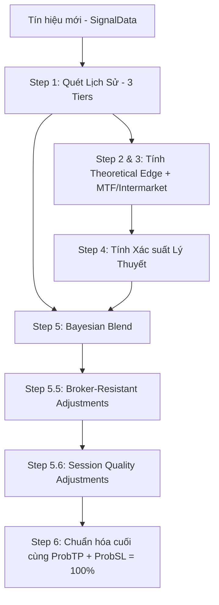

# RSI Advanced - Probability Engine Review

## 1. Tổng Quan Thuật Toán (Algorithm Overview)

Thuật toán trong `ProbabilityEngine.mqh` (hàm `CalculateProbability`) không phải là một công thức tính xác suất tĩnh đơn giản. Nó là một **Hệ thống suy luận Bayes (Bayesian Inference System)** kết hợp giữa tỷ lệ thắng lịch sử (Empirical Data) và xác suất lý thuyết (Theoretical Edge).

### Sơ đồ Luồng Xử Lý (Pipeline)

---

## 2. Phân Tích Chi Tiết Từng Bước & Công Thức

### Bước 1: Historical Simulation (Thu thập dữ liệu thực tế)
Thuật toán phân loại dữ liệu lịch sử thành 3 nhóm (Tiers) có độ tin cậy giảm dần:
- **Tier 1 (Độ tin cậy cao nhất):** Các tín hiệu cùng chiều (Buy/Sell) VÀ cùng loại (Case Number).
- **Tier 2 (Độ tin cậy trung bình):** Các tín hiệu cùng chiều nhưng KHÁC loại (Case Number).
- **Tier 3 (Độ tin cậy thấp nhất):** Nếu T1 + T2 không đủ mẫu (`minSamples`), thuật toán sẽ quét lại nến trong quá khứ dựa trên sự tương đồng về vùng RSI và độ lớn ATR (Fallback mechanism).

**Công thức gán trọng số (Weighting):**
Trọng số được tính theo căn bậc 2 của số lượng mẫu (Square root rule) để chống nhiễu:
- $W_1 = \sqrt{N_1} \times 1.0$
- $W_2 = \sqrt{N_2} \times 0.5$
- $W_3 = \sqrt{N_3} \times 0.25$
Xác suất lịch sử ($HistTP1$) là trung bình có trọng số của 3 nhóm này.

### Bước 2 & 3: Theoretical Edge & MTF/Intermarket
Thuật toán đo lường lợi thế cơ sở ($Edge$) từ lịch sử tổng quát (`MeasureEdgeFromHistory`) và cộng thêm điểm nếu:
- Đa khung thời gian (MTF) đồng thuận: Tối đa $+0.03$.
- Phân tích liên thị trường (Intermarket) đồng thuận: Tính từ `GetIntermarketEdgeAdjustment`.
=> Kết quả bị giới hạn (clamped) trong khoảng **40% đến 70%** ($AdjustedEdge$).

### Bước 4: Theoretical Probability
Dựa vào $AdjustedEdge$ và khoảng cách thực tế (SL Dist, TP Dist), thuật toán dùng mô hình rủi ro của thị trường thật (có lẽ là mô hình Random Walk có trôi - Drifted Random Walk hoặc Gambler's Ruin) để tính $TheoTP1$.

### Bước 5: Bayesian Combine (Kết hợp)
Nếu có dữ liệu lịch sử (Total > 3), thuật toán dùng hàm `CombineTheoreticalHistorical` để trộn $TheoTP1$ và $HistTP1$. Càng có nhiều mẫu lịch sử, trọng số của $HistTP1$ càng cao.

### Bước 5.5: Penalty (Phạt trừ điểm)
- **1-Bar Confirmation:** Nếu nến tiếp theo không xác nhận xu hướng (VD: tín hiệu Buy nhưng nến sau tạo đỉnh thấp hơn), xác suất bị trừ đi 3% đến 15% tùy khung thời gian.
- **ATR Spike:** Nếu nến hiện tại có ATR lớn hơn 2 lần ATR trung bình (biến động đột biến), xác suất bị kéo ngược về 50% (tình trạng hên xui do nhiễu loạn giá).

### Bước 5.6: Session Quality (Inverse Variance Weighting)
Nếu phiên giao dịch hiện tại (ví dụ: London, Asian) có trên 20 mẫu, hệ thống sẽ pha trộn xác suất hiện tại với Win Rate thực tế của phiên đó.
Sử dụng công thức Inverse Variance (Nghịch đảo phương sai) của phân phối nhị thức (Wilson Score Interval). Nguồn dữ liệu nào có sai số (Standard Error) nhỏ hơn sẽ được tin tưởng hơn.

---

## 3. Đánh Giá Tính Chính Xác & Dữ Liệu Cung Cấp

### Điểm Tốt (Strengths):
1. **Thiết kế chuẩn Quant:** Thuật toán sử dụng Inverse Variance Weighting, Bayesian Blending và Square root of N. Đây là các phương pháp chuẩn trong định lượng để xử lý "cỡ mẫu nhỏ" mà không bị overfitting.
2. **Kháng nhiễu Broker:** Việc dùng 1-Bar Confirmation và ATR Spike detection giúp loại bỏ các tín hiệu lỗi do spread dãn hoặc tick ảo của broker.

### Điểm Yếu Chết Người (Critical Weaknesses) trong việc cấp Dữ liệu:

**1. Vấn đề "Timeout" của Historical Scan (`maxFwd`)**
- Ở Bước 1 (`ScanStoredSignals`), thuật toán chỉ mô phỏng kết quả của các tín hiệu trước đó trong giới hạn `maxBarsForward`.
- Nếu trên khung M1, một lệnh có SL/TP rộng (ví dụ 30 pip) thì rất hiếm khi hit SL/TP trong vòng 30-50 nến. Kết quả là lệnh trả về `out = 0` (Timeout).
- **Hậu quả:** Hệ thống vứt bỏ một lượng khổng lồ dữ liệu hợp lệ vì lệnh chưa kịp chốt. Điều này làm số lượng mẫu (N) bị kéo xuống thấp, dẫn đến hệ thống phải dựa dẫm vào Xác suất lý thuyết (Theoretical Edge) thay vì dữ liệu thật.

**2. Quá trình tính "Session Stats" bị gộp chung Case**
- Ở Bước 5.6, `g_sessionStats` đo Win Rate của CẢ PHIÊN (ví dụ Asian Win Rate = 35%). Thuật toán lấy số đó pha trộn cho tín hiệu hiện tại.
- **Vấn đề:** Trong phiên Asian, Breakout (Case 7) có thể có Win Rate 10%, nhưng Reversal (Case 1) lại có Win Rate 70%. Gộp chung lại ra 35% và áp dụng cho một tín hiệu Case 1 đang xuất hiện là **SAI LỆCH TOÀN BỘ BẢN CHẤT**.

**3. Giới hạn cứng của Theoretical Edge (40% - 70%)**
- Tại Bước 3: `adjustedEdge = MathMax(0.40, MathMin(0.70, measuredEdge + edgeAdjustment));`
- Việc kẹp cứng (Clamp) tối đa ở 70% làm mất đi cơ hội của các siêu tín hiệu (Super Setups) như Case 2 (Divergence) mà ta vừa thấy có WR 96% ở phân tích trước. Xác suất hiển thị cho user sẽ không bao giờ phản ánh được độ mạnh thực sự >80%.

---

## 4. Giải Pháp Nâng Cấp Tương Lai

1. **Sửa lỗi Timeout (`maxFwd`):**
   - Không nên đặt `maxFwd` bằng số lượng nến cố định.
   - Thay vào đó, dùng logic **"Time-to-Resolve"**: Khi quét lịch sử, cứ chạy tới khi nào chạm SL/TP thì dừng, hoặc giới hạn theo thời gian (ví dụ: tối đa 24 tiếng = 1440 nến M1).

2. **Session Stats theo Case:**
   - Cần chẻ cấu trúc `g_sessionStats` ra thành mảng 2 chiều: `g_sessionStats[SessionBlock][CaseNumber]`. Việc đánh giá chất lượng phiên phải đi kèm với loại tín hiệu.

3. **Mở biên độ Clamping & Tăng trọng số Tier 1:**
   - Đổi `MathMin(0.70, ...)` thành `0.85` hoặc `0.90` để phản ánh đúng các tín hiệu xuất sắc.
   - Trọng số $W_1$ (Tier 1) hiện tại là $\times 1.0$, trong khi dữ liệu cùng Case thực sự mang giá trị cốt lõi. Nên đổi $W_1$ thành hàm Exponent (E.g. $W_1 = N_1^{0.8}$) thay vì $N_1^{0.5}$ để ưu tiên dữ liệu chính xác này mạnh hơn.
