# Báo Cáo Phân Tích Định Lượng (Quant Analysis) — RSI Advanced M5

Dựa trên dữ liệu logs thực tế thu thập từ tài khoản của anh trên biểu đồ **XAUUSDc M5** (tổng cộng **130 tín hiệu** và **258 outcome updates** từ ngày 04/06/2026 đến 05/06/2026), chúng tôi đã tiến hành phân tích định lượng để xác định những tín hiệu hiệu quả nhất và đưa ra các khuyến nghị tối ưu hóa tham số.

---

## 1. Tổng Quan Kết Quả Hệ Thống
- **Tổng số tín hiệu độc nhất**: 130
- **Tổng số tín hiệu đã có kết quả (Resolved)**: 128 (còn 2 lệnh pending)
- **Tỷ lệ kết quả thực tế**:
  - **SL Hit (Cắt lỗ)**: 59 lệnh (46.1%)
  - **TP1 Hit (Chốt lời 1)**: 47 lệnh (36.7%)
  - **Reversal (Đảo chiều đóng sớm)**: 22 lệnh (17.2%)
- **Tỷ lệ thắng trung bình (Win Rate - chỉ tính TP1)**: **36.7%**

---

## 2. Hiệu Suất Theo Từng Loại Tín Hiệu (Case)

| Case | Tên Tín Hiệu | Số Tín Hiệu | Số Lệnh Thắng (TP1) | Số Lệnh Thua (SL) | Số Lệnh Đóng Sớm (Reversal) | Tỷ Lệ Thắng (Win Rate) | MFE Trung Bình | MAE Trung Bình | ATR Trung Bình |
| :---: | :--- | :---: | :---: | :---: | :---: | :---: | :---: | :---: | :---: |
| **7** | **SidewayBreak** | **5** | **4** | **0** | **1** | **80.0%** | **8.650** | **3.293** | **4.471** |
| **4** | **StrongTrend** | **4** | **2** | **2** | **0** | **50.0%** | **9.781** | **6.692** | **4.983** |
| **5** | **OrangeLevel** | **4** | **2** | **1** | **1** | **50.0%** | **7.297** | **9.468** | **8.873** |
| **6** | **TrendCont** | **108** | **38** | **55** | **15** | **35.2%** | **6.578** | **6.998** | **4.568** |
| **3** | **HiddenDiv** | **4** | **1** | **0** | **3** | **25.0%** | **2.116** | **0.918** | **5.990** |
| **2** | **RegularDiv** | **2** | **0** | **1** | **1** | **0.0%** | **2.134** | **6.488** | **4.354** |
| **1** | **OBOSBounce** | **1** | **0** | **0** | **1** | **0.0%** | **0.000** | **0.000** | **3.764** |

> [!NOTE]
> - **MFE (Max Favorable Excursion)**: Mức lợi nhuận tối đa lệnh đạt được (tính bằng giá trị tuyệt đối).
> - **MAE (Max Adverse Excursion)**: Mức âm vốn tối đa lệnh phải chịu đựng trước khi đạt đích hoặc đóng.

### Nhận xét cốt lõi về Case:
1. **Case 7 (SidewayBreak - Phá vỡ đi ngang)** là **tín hiệu hiệu quả nhất**: Tỷ lệ thắng **80.0%**, không có lệnh nào bị quét SL thẳng, MAE cực thấp (3.293 so với ATR 4.471), cho thấy entry cực kỳ chính xác và ít bị drawdown.
2. **Case 6 (TrendCont - Tiếp diễn xu hướng)** là **nguyên nhân kéo giảm hiệu suất**: Chiếm tới **83% tổng số tín hiệu** (108/130) nhưng tỷ lệ thắng chỉ đạt **35.2%** với MAE trung bình (6.998) lớn hơn cả MFE trung bình (6.578). Cần phải siết chặt bộ lọc đối với Case này.

---

## 3. Hiệu Suất Theo Hướng Giao Dịch (BUY vs SELL)

| Hướng (DIR) | Số Tín Hiệu | Thắng (TP1) | Thua (SL) | Đóng Sớm (Reversal) | Tỷ Lệ Thắng (Win Rate) | MFE Trung Bình | MAE Trung Bình |
| :---: | :---: | :---: | :---: | :---: | :---: | :---: | :---: |
| **BUY** | 66 | 28 | 27 | 11 | **42.4%** | **6.788** | **6.759** |
| **SELL** | 62 | 19 | 32 | 11 | **30.6%** | **6.237** | **6.570** |

> [!TIP]
> Lệnh **BUY** có hiệu suất tốt hơn rõ rệt lệnh **SELL** trên XAUUSD M5 (Tỷ lệ thắng cao hơn 12%, MFE cao hơn). Điều này phản ánh xu hướng tăng chủ đạo (Bullish bias) của Gold trong giai đoạn này.

---

## 4. Hiệu Suất Theo Phiên Giao Dịch (Sessions)

| Phiên (SESSION) | Số Tín Hiệu | Thắng (TP1) | Thua (SL) | Đóng Sớm (Reversal) | Tỷ Lệ Thắng (Win Rate) | MFE Trung Bình | MAE Trung Bình |
| :---: | :---: | :---: | :---: | :---: | :---: | :---: | :---: |
| **London** | **44** | **24** | **15** | **5** | **54.5%** | **7.384** | **5.642** |
| **Overlap** | **22** | **11** | **5** | **6** | **50.0%** | **10.606** | **7.677** |
| **Asian** | **46** | **12** | **26** | **8** | **26.1%** | **5.348** | **7.822** |
| **LateNY** | **16** | **0** | **13** | **3** | **0.0%** | **1.909** | **4.784** |

> [!WARNING]
> - **Phiên London và Overlap (Mỹ-Âu)** là thời điểm vàng: Tỷ lệ thắng đều đạt từ **50% - 54.5%**, MFE trong phiên Overlap cực kỳ cao (10.606), cho thấy lực đi rất mạnh.
> - **Phiên Asian và LateNY** là "hố đen" mất tiền: Phiên Á tỷ lệ thắng chỉ **26.1%** do thị trường thường đi ngang, tạo nhiều breakout giả. Phiên LateNY (cuối ngày Mỹ) có tỷ lệ thắng là **0.0%** (13 lệnh thua, 3 lệnh đảo chiều), tuyệt đối không giao dịch M5 trong khung này.

---

## 5. Điểm Sáng Giao Dịch (Sweet Spots) vs Vùng Nguy Hiểm

Kết hợp **Case + Phiên** để tìm ra các kịch bản tối ưu nhất:

### Các Sweet Spots hiệu quả cao nhất (Độ tin cậy lớn):
1. **Case 6 (TrendCont) trong Phiên London**: **56.4% Win Rate** (39 tín hiệu, 22 thắng).
   - *Đặc điểm*: Xu hướng tiếp diễn được hình thành rất chuẩn vào đầu phiên Âu, lực đi mạnh và ổn định.
2. **Case 7 (SidewayBreak) trong Phiên Á**: **75.0% Win Rate** (4 tín hiệu, 3 thắng).
   - *Đặc điểm*: Dù phiên Á nhìn chung kém, nhưng khi có sự phá vỡ vùng tích lũy đi ngang (SidewayBreak), lệnh đi rất mượt và ít bị rút râu giật ngược lại (MAE trung bình chỉ 2.26).
3. **Case 6 (TrendCont) trong Phiên Overlap**: **50.0% Win Rate** (16 tín hiệu, 8 thắng, MFE cực đại 11.63).
   - *Đặc điểm*: Thích hợp cho các lệnh ăn sóng dài TP2/TP3.

### Vùng Nguy Hiểm cần chặn (Filters):
1. **Case 6 (TrendCont) trong Phiên Á**: **21.6% Win Rate** (37 tín hiệu, chỉ thắng 8). Drawdown (MAE) trung bình lên tới 9.13 (gấp gần 2 lần MFE).
   - *Nguyên nhân*: Phiên Á thiếu thanh khoản, các tín hiệu cố gắng tiếp diễn xu hướng cũ thường xuyên bị đảo chiều.
2. **Case 6 (TrendCont) trong Phiên LateNY**: **0.0% Win Rate** (16 tín hiệu, thua sạch 13 lệnh, 3 lệnh huỷ).
   - *Nguyên nhân*: Cuối ngày thị trường cạn kiệt khối lượng giao dịch.

---

## 6. Đề Xuất Tối Ưu Hóa Tham Số Theo Định Lượng (Quant Recommendations)

Dựa trên chỉ số MFE/ATR và MAE/ATR thực tế của các tín hiệu trên, chúng tôi đề xuất tối ưu hóa bộ tham số R:R (SL/TP) thay vì sử dụng tỷ lệ cố định mặc định (SL=2.0 ATR, TP1=2.0 ATR):

```mermaid
gantt
    title Đề xuất tối ưu hóa SL/TP theo Case (Đơn vị: ATR)
    dateFormat  X
    axisFormat %s
    
    section Case 7 (SidewayBreak)
    SL mới (1.2 ATR)       :active, 0, 1.2
    TP1 mới (1.8 ATR)     :crit, 1.2, 3.0
    
    section Case 6 (TrendCont)
    SL mới (2.2 ATR)       :active, 0, 2.2
    TP1 mới (1.2 ATR)     :crit, 2.2, 3.4
```

### Chi Tiết Cấu Hình Lại R:R:

#### A. Đối với Case 7 (SidewayBreak):
- **Tình trạng hiện tại**: Win rate rất cao (80%), MAE trung bình chỉ đạt 0.84 ATR.
- **Khuyến nghị**: 
  - **Giảm SL xuống 1.2 ATR** (thay vì 2.0 ATR). Việc này tăng tỷ lệ R:R lên rất nhiều mà không sợ bị quét SL.
  - **Đặt TP1 ở 1.8 ATR** (hoặc giữ nguyên 2.0 ATR).
  - *Kết quả kỳ vọng*: Nâng R:R từ 1:1 lên **1:1.5**, gia tăng mạnh Profit Factor.

#### B. Đối với Case 6 (TrendCont):
- **Tình trạng hiện tại**: Win rate thấp (35.2%), MAE trung bình lên tới 1.56 ATR, trong khi MFE trung bình chỉ đạt 1.40 ATR (giá không chạy tới nổi TP1 = 2.0 ATR mặc định).
- **Khuyến nghị**:
  - **Giảm TP1 xuống 1.2 ATR** (hoặc tối đa 1.3 ATR) để chốt lời nhanh theo trung bình MFE.
  - **Tăng SL lên 2.2 ATR** để tránh bị quét bởi các đợt pullback nhiễu nến M5, hoặc áp dụng **Trailing Stop chặt chẽ** khi giá chạy được 0.8 ATR.
  - **Chặn hoàn toàn** tín hiệu Case 6 trong phiên **Asian** và **LateNY**.

### Tóm tắt bộ lọc Session Filter cần thiết lập:
- **BẬT** giao dịch: Cả ngày đối với **Case 7**.
- **TẮT** giao dịch đối với **Case 6** trong khoảng thời gian từ **16:00 đến 08:00 UTC** ngày hôm sau (bao gồm cả phiên Á và cuối phiên Mỹ). Chỉ cho phép Case 6 hoạt động trong phiên Âu và trùng phiên Âu-Mỹ (08:00 - 16:00 UTC).
