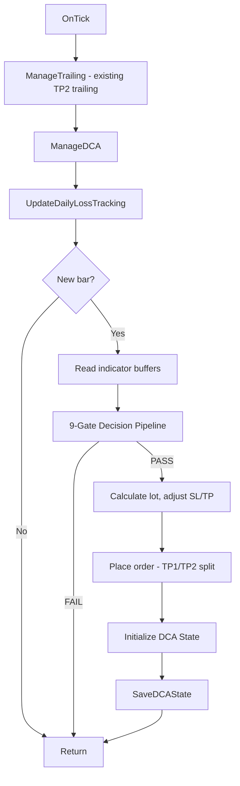
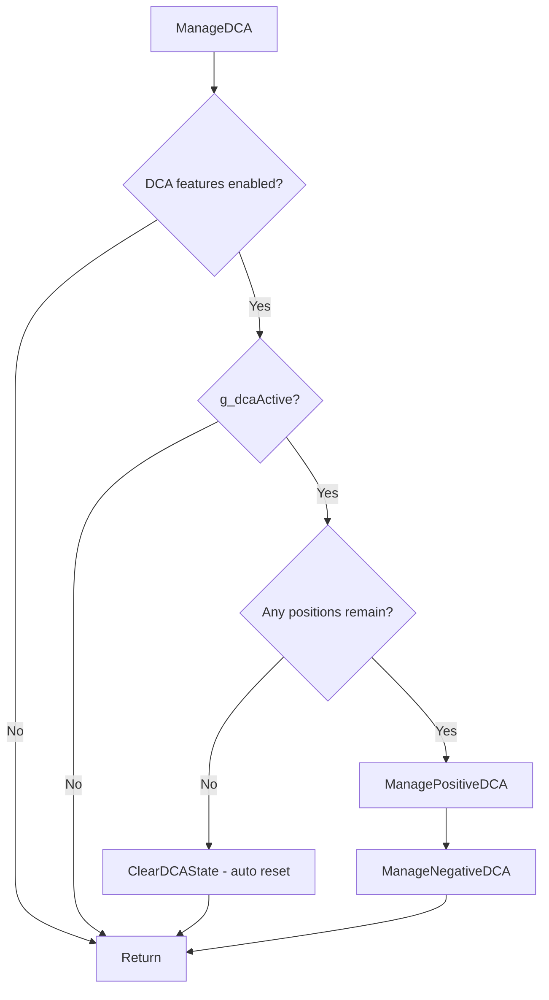
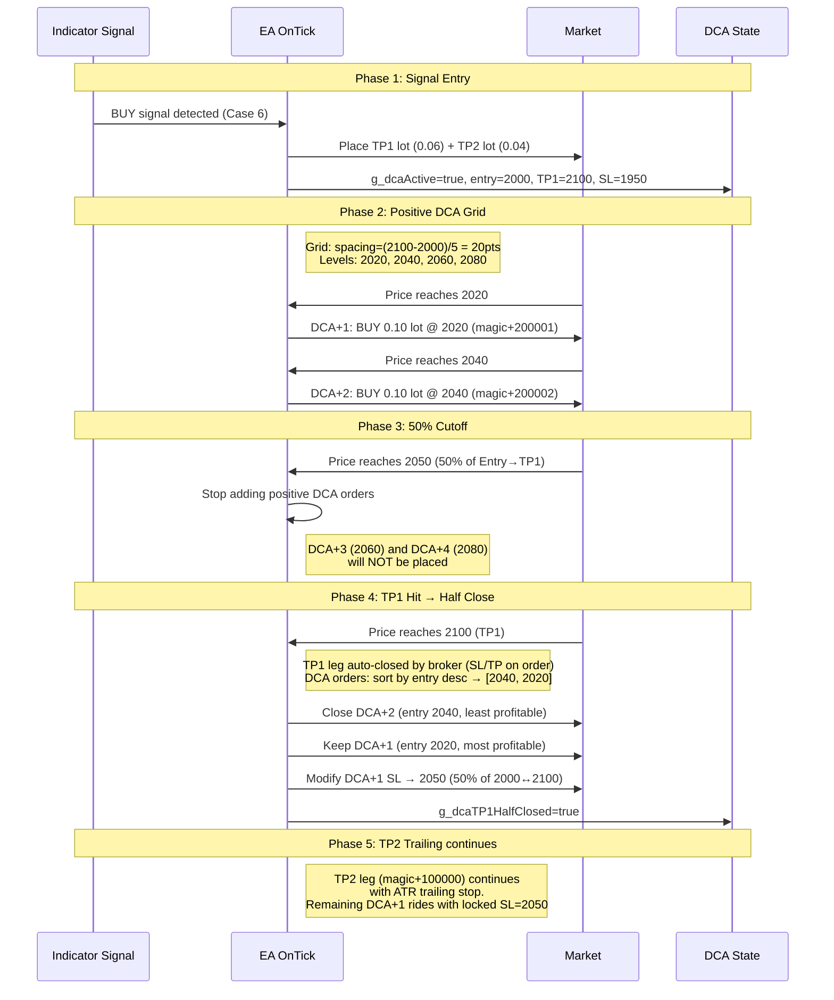
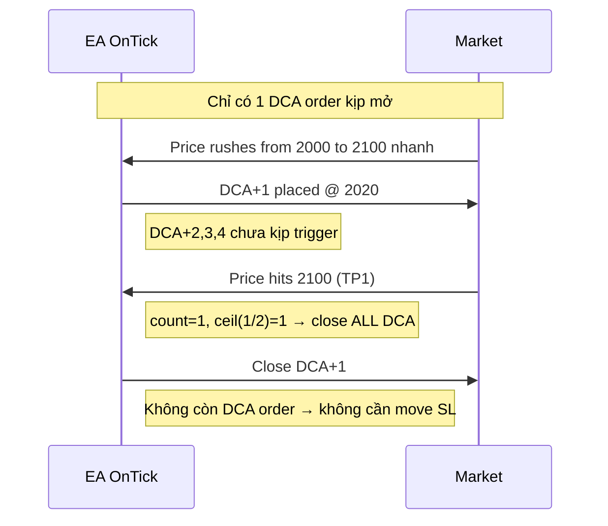
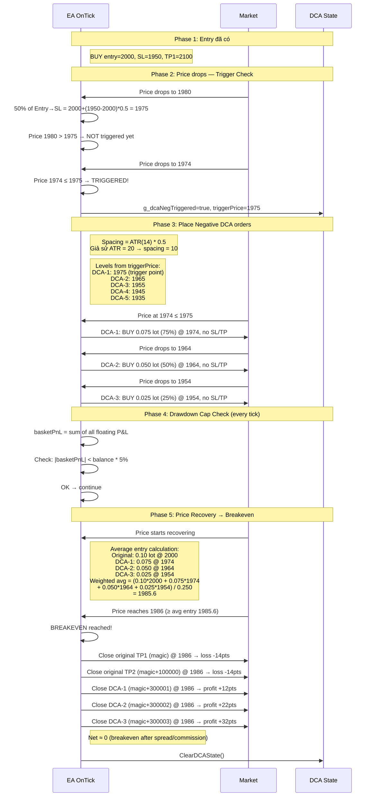
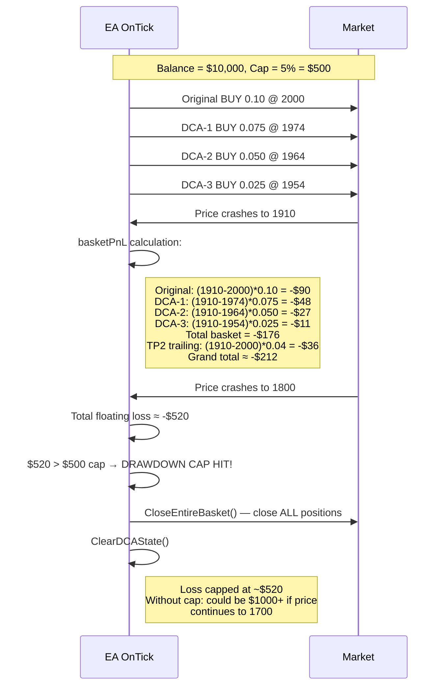
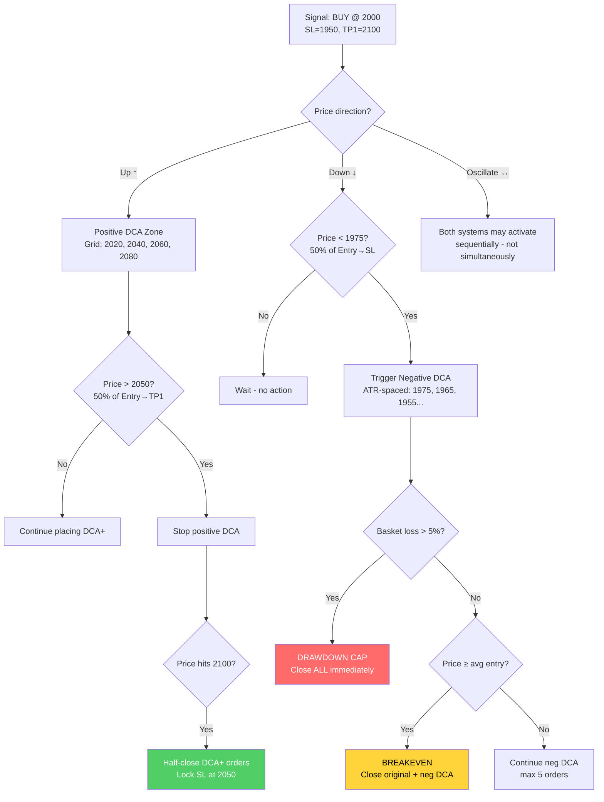
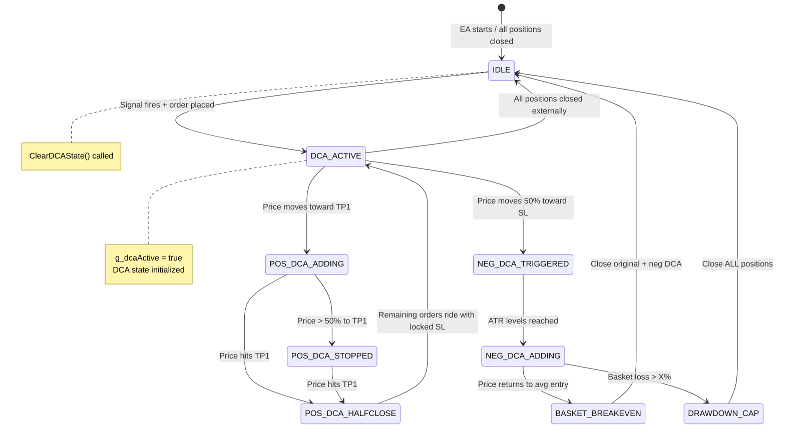
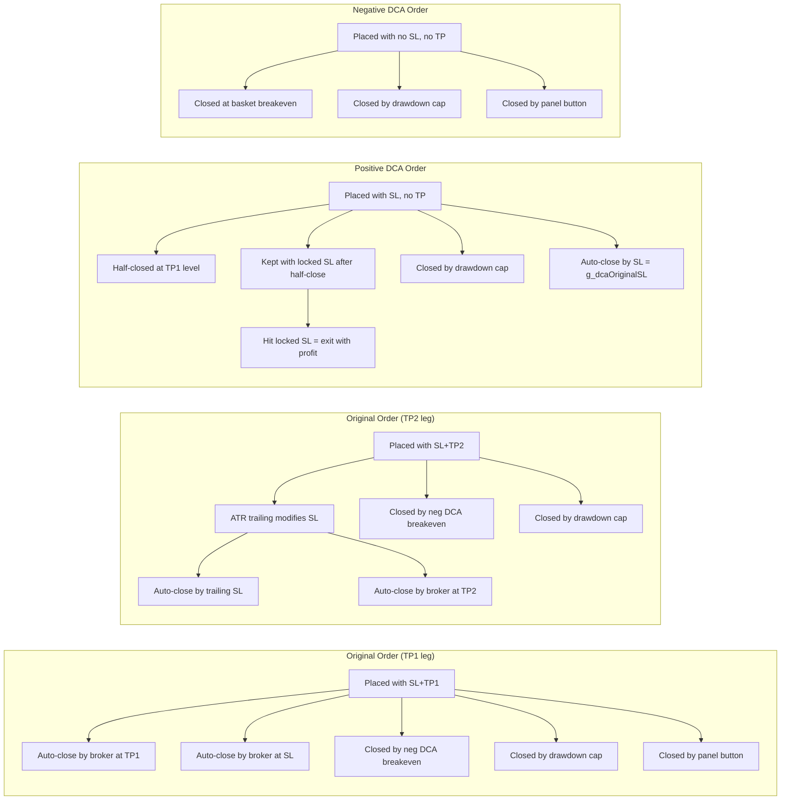

# DCA Strategy — Flowcharts & Sequence Diagrams

## 1. Tổng quan OnTick() Flow với DCA

## 2. ManageDCA() Wrapper Flow

## 3. Positive DCA — Full Lifecycle

## 4. Positive DCA — Edge Case: Giá chạm TP1 nhanh (ít DCA orders)

## 5. Negative DCA — Full Lifecycle

## 6. Negative DCA — Drawdown Cap Hit

## 7. Positive + Negative DCA Combined Scenario

## 8. State Machine Diagram

## 9. Order Lifecycle per Type

